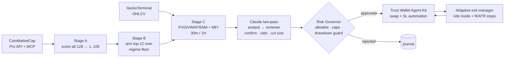

# 🔮 TradingPalantir


**A Palantir-style AI command center for autonomous spot trading on BNB Smart Chain.**
Built for **BNB HACK: AI Trading Agent Edition — CoinMarketCap × Trust Wallet**, Track 1 (Autonomous Trading Agents).

> **We don't ask an LLM whether to buy.**
> The agent scores the whole eligible universe, arms only high-conviction candidates, detects entries with a proprietary deterministic strategy, manages positions through adaptive exits, and executes through Trust Wallet Agent Kit — **only after deterministic risk approval.** LLMs classify and explain; they never execute.

## The problem

Most "AI trading agents" are an LLM with a wallet — they hallucinate trades, chase pumps, and blow up. An LLM asked "should I buy?" will always find a reason to say yes. TradingPalantir inverts that: **a deterministic engine decides and a deterministic Risk Governor pulls the trigger**; the LLM is a constrained advisor that can only confirm, veto, or cut size — never raise risk, never sign a transaction.

## On-chain identity & proof

| | |
|---|---|
| Agent wallet (BSC) | `0xAaD844634247B124Eb8cA93378fF7E3608E7a290` |
| Competition registration | [`0xd75091…03780e`](https://bscscan.com/tx/0xd75091adb91e58ac97523311057b96254b752ef6ef9abddfb4649b52d403780e) |
| ERC-8004 identity | **agentId 132867** — [`0xb43484…e180a7`](https://bscscan.com/tx/0xb434847f03f449df059e13ad09447dc3b3ca6765dbc3ca551a9217bc90e180a7) → [agent_card.json](agent_card.json) |
| Live execution proof | buy [`0x2c9222…625709`](https://bscscan.com/tx/0x2c92229dbfaba5da418f6dbd0803352b38b5ea9e9c2607e89fb38e9127625709) · sell [`0x7403d8…963a31`](https://bscscan.com/tx/0x7403d8d783c51ccf34d186a86b84216e31e419cde182edcc664e921abb963a31) |

## Sponsor stack — all three layers

| Layer | How TradingPalantir uses it |
|---|---|
| **CoinMarketCap** | Coin selection runs on CMC: Pro API batch quotes for universe screening + CMC **MCP** (AI Agent Hub) for trending narratives (social keywords + unique authors), per-coin news, global & derivatives metrics, macro events. Official CMC Skills are replicated natively as `EvidenceItem`-producing pipelines (`macro liquidity monitor`, `Detect Market Regime`, `altcoin breakout scanner spot`, `Verify New Token Safety`, …). |
| **Trust Wallet Agent Kit** | The **sole** execution layer (`@trustwallet/cli`): swaps (PancakeSwap routing), stop-loss limit automations (add/list/delete, OCO bookkeeping), wallet/portfolio reads, on-chain competition registration, and ERC-8004 identity mint. Self-custody — keys never leave the agent wallet. |
| **BNB AI Agent SDK** | On-chain **ERC-8004** agent identity (**agentId 132867**) minted via twak, with `agent_card.json` as the agent URI. |

## The core idea: right coin × right moment × don't cut the winner

```
Stage A  SCORE EVERYTHING      all 128 eligible BEP-20 tokens → composite score 1..100
                               (volume/liquidity 25 · momentum 20 · social 15 ·
                                derivatives pressure ±15 · sector 10 · regime fit 10
                                · safety firewall gate · normalized so 100 = perfect)
Stage B  ARM THE BEST          top-20 watchlist → ARMED set = coins above an adaptive
                               quality floor (70/74/80 by market regime), capped at
                               the top 12 (rate-limit + focus)
Stage C  HUNT THE SETUP        bar-by-bar monitoring of armed coins only →
                               proprietary FVG + VWAP + multi-timeframe-EMA entry,
                               confirmed by MFI money-flow (OscMatrix),
                               FVG entries taken on 30m / 1H only (5m/15m = noise)
ENTRY    score gate → Claude analyst → independent Claude reviewer → Risk Governor
MANAGE   normal mode: fixed TP (3R) + fractal stop
         confluence (MoneyFlow bull AND Trendflex > 0) latches RIDE MODE:
         TP removed, hold while Trendflex > 0, exit on flip ≤ 0
         protective stops underneath: +1R→breakeven, +2R→+1R, ATR trail (up only)
```



The strongest edge is **adaptive exit optimization**: most bots cut winners with a fixed take-profit. TradingPalantir rides confirmed trends with a custom Trendflex oscillator (Ehlers SuperSmoother + RMS normalization) and protects profit with R-multiple/ATR stop progression — while a hard stop-loss and the deterministic Risk Governor guard every position.

## Architecture

```
CoinMarketCap Pro API + CMC MCP (AI Agent Hub) + GeckoTerminal OHLCV
        ↓
cmc/            clients + skill-equivalents (native replicas of CMC Skills)
intelligence/   market regime · derivatives pressure · opportunity radar (1-100)
                token risk firewall · evidence items (honest partial/blocked)
strategy/       proprietary entry engine (FVG/VWAP/EMA, untouched core)
                + OscMatrix (MoneyFlow + Trendflex) — MFI gate confirms entries,
                  Trendflex drives ride-mode exits — + decision engine
exit/           adaptive exit manager (ride mode, R/ATR protective stops)
risk/           Risk Governor (final authority) · tiered drawdown guard (12/18/25%)
                daily trade monitor (≥1 trade/day, risk-gated fallback)
llm/            Claude two-pass: analyst proposes → independent reviewer challenges
                (capability-gated: can only reduce risk, never execute)
execution/      paper broker + live router → Trust Wallet Agent Kit (self-custody)
journal/        SQLite + JSONL event log (every decision, score, veto, fill)
dashboard/      Streamlit command center
```

### Safety principles
- LLMs **cannot** execute, sign, raise risk, or bypass rules — `size_factor` is clamped ≤ 1 and the deterministic **Risk Governor** is the final authority on every action.
- Hard allowlist: only the 128 traded BEP-20 tokens (of the 149 eligible; stablecoins excluded), by contract address.
- Every trade has a stop-loss before entry; no averaging down; tiered drawdown guard (defensive → block → emergency flatten).
- Paper mode validated before any live execution; full journal of every decision.

## Why concentrated? (asymmetric, by design)

The agent runs a **fixed $50 spot account** (no leverage, no deposits) and plays to win the ranking, not to place mid-pack. Track 1 is ranked by **total return**, with max drawdown only as a gate — so capital is deployed with conviction: **up to 2 concurrent positions, each ~50% of the book** (≈$22.5 notional cap), on different symbols (one-position-per-symbol). Sizing is notional-driven — a raised risk budget makes the notional cap the binding constraint, so each position is ~half the book regardless of stop width (effective risk per trade scales with the stop, typically $1–6).

The downside floor is a **tiered drawdown guard — 12% → defensive (risk & position size halved) · 18% → block new entries · 25% → emergency flatten** — which keeps the agent under the competition's drawdown cap, while ~$5 is always reserved so the mandatory ≥1-trade-per-day rule can never be missed. Concentrated upside, hard floor under the downside.

> **Note on parameters.** All risk/sizing numbers reflect a fixed $50 spot account and live in [`config/rules.json`](config/rules.json) and [`config/settings.py`](config/settings.py) — tune them there, no code changes required.

## Reproducing

```bash
git clone https://github.com/Tyled763/tradingpalantir && cd tradingpalantir
pip install -r requirements.txt
npm install -g @trustwallet/cli        # twak
cp .env.example .env                   # fill in your own keys
python3 -m pytest tests/ -q            # 49 unit tests
python3 -m scripts.run_agent           # paper mode by default (DRY_RUN=True)
streamlit run dashboard/app.py         # command center
python3 -m scripts.replay ETH          # historical replay of the full pipeline
```

Live mode: set `DRY_RUN = False` in `config/settings.py` (requires a funded twak wallet; see `.env.example`).

## License

MIT
